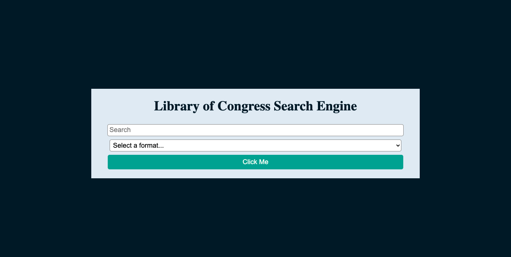
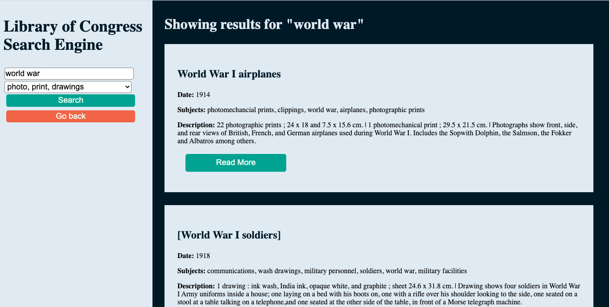

# Library-of-Congress-Search-Tool
<a href="https://tbetti.github.io/Library-of-Congress-Search-Tool/">Link to application</a>
<h3>Description</h3>

This application allows users to search the Library of Congress' database using keywords. Users are able to search in all formats or they can choose to search within a specific format. The formats include maps, audio recordings, photos/print/drawings, manuscripts, newspapers, film/videos, printed music, or archived websites.

<h3>Technologies Used</h3>
<ul>
    <li>Library of Congress: JSON API - <a href="https://libraryofcongress.github.io/data-exploration/index.html"> view documentation</a></li>
    <li> HTML/CSS/JS</li>
</ul>
<h3>How it Works<h3>

Upon entering the application, users are taken to the homepage and then prompted to input search keyword(s) and select a format from a dropdown menu (see image below).

After entering input, the application redirects to the search results page and uses user input to request data from the Library of Congress API. After receiving data, it displays the title, date, subjects, and description of up to 25 results. Users may select the "Read More" button on each result which takes them to the Library of Congress site where they can learn more about each source (see image below)

